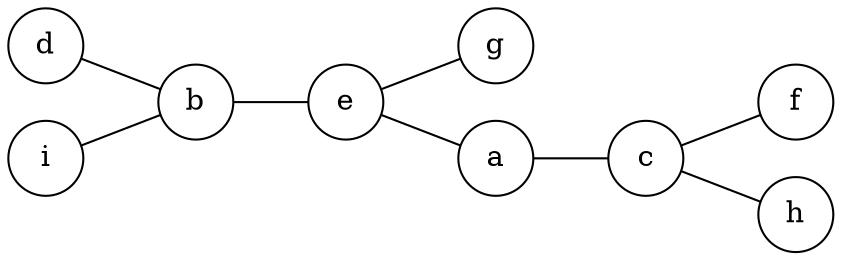
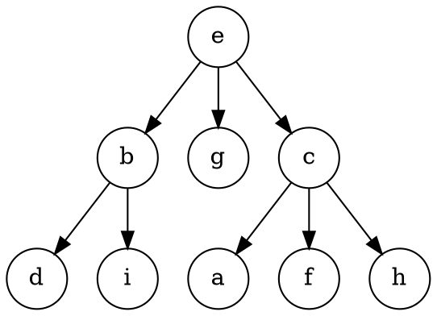
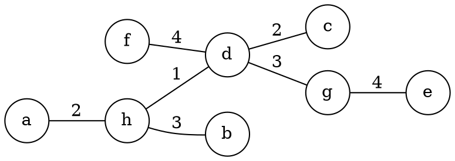
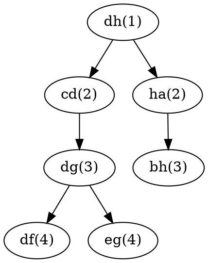
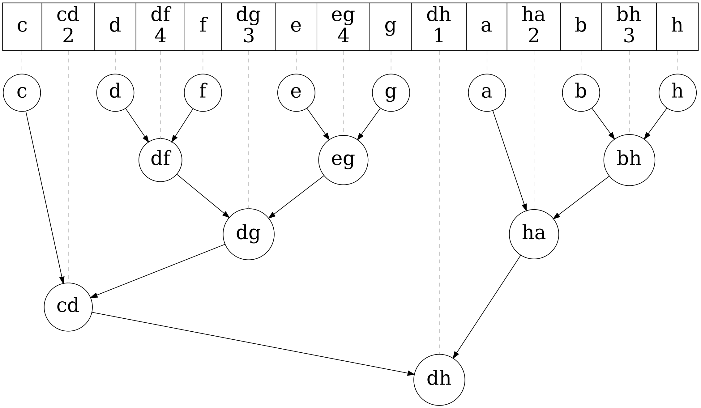
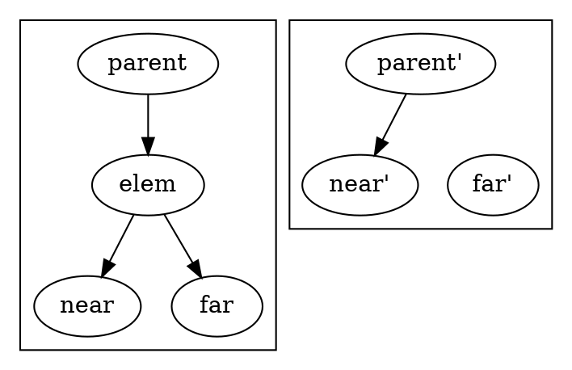

> This post has been rewritten in May 2020.

A few days ago, I was thinking about the tree generated from recursively performing centroid decomposition as well as Cartesian trees, and noticed a surprising similarly. I continued exploring this idea, and rediscovered a data structure that provides new insight into graph problems based on the max/min edge weight along paths (widest path/bottleneck edge problems).

<!--more-->

# Preface: Existing Terminology

It turns out a portion of what I've discussed here already exists, and can be found by searching "Cartesian tree of edges" -- [this paper][demaine2009] for example.

[demaine2009]: https://erikdemaine.org/papers/Cartesian_ICALP2009/paper.pdf

However, my terminology I use in this post differs from what's used in existing literature. In particular:

- What I call a *Cartesian Tree of a Tree* is not described in literature
- What I call a *Kruskal Tree* is called a *Cartesian Tree of a Tree* in the above paper.

I apologise for this confusion, but it's somewhat unavoidable, as you'll see later on.

# Centroid Trees

I'll lay out the path to get to the Kruskal Tree. First, a few definitions, if you're not familiar with them:

- A **centroid** of a tree is a vertex that, when removed, leaves components which are at most half the size of the original tree.
- A **centroid tree** (also known as the **centroid decomposition** of a tree) is generated by extracting the centroid of a tree, then making the centroid decomposition of the remaining components its children.

*Figure 1: A random tree*

*Figure 2: The centroid decomposition of above tree*

Centroid trees are similar to binary search trees in that

1. the height is small; and
2. nodes in a subtree represent connected elements.

These properties are useful for "binary searching" on a tree e.g. in the problems [Nav (FARIO 2019)][fario2019nav] and [Dynamic Diameter (CEOI 2019)][ceoi2019dd]. In fact, the centroid tree and the binary search tree of a [linear/path graph][line-graph] are identical.

[fario2019nav]: https://orac.amt.edu.au/cgi-bin/train/problem.pl?set=fario19&problemid=1064
[ceoi2019dd]: https://codeforces.com/problemset/problem/1192/B
[line-graph]: https://en.wikipedia.org/wiki/Path_graph

# Cartesian Tree of a Tree

By using the similarity between centroid trees and binary search trees, we can arrive at the Cartesian tree of a tree: Instead of extracting the centroid, we instead extract the node with the least value. Just like centroid trees, doing this conversion on a linear graph produces a normal Cartesian tree.

However, this data structure isn't of much interest to us (we're using just as a stepping stone towards Kruskal Trees). One possible use to convert queries of "what is the minimum node on the path from A to B" into [Lowest Common Ancestor][lca] queries. It's likely that "what is the minimum node in a given connected subgraph" queries can also be supported using a similar method.

[lca]: https://en.wikipedia.org/wiki/Lowest_common_ancestor

# Kruskal Tree

> These were called *edge trees* in my original post, but I feel *Kruskal tree* is a better name given the similarities between the tree I describe and Kruskal's algorithm.

One annoying aspect of the above data structure is that the number of children of each node is practically unbounded, with the worst case being a [star graph][star-graph]. One method of sidestepping this issue (and getting a few other benefits) is to instead build the data structure over the *edges* of the input, instead of the vertices:

[star-graph]: https://en.wikipedia.org/wiki/Star_(graph_theory)

1. Pick the edge with the largest weight and extract it as the root of a new tree
2. Recursively transform the two remaining components and add them as children of the extracted edge.

As an example, if we perform this procedure on this tree:

*Figure 3: A weighted tree*

We'll get the following tree:

*Figure 4: Result of transforming fig. 4*

Do note that we lose the small tree height by doing this.

Due to the nature of edges, each node in our data structure is guaranteed to have at most 2 children, and so we will always get a binary tree out. With this transformation, we can convert "what is the minimum/['bottleneck' edge][bottleneck] on the path from edge E to edge F" queries into [Lowest Common Ancestor][lca], similar to the Cartesian tree. 

[bottleneck]: https://en.wikipedia.org/wiki/Widest_path_problem

However, typical [bottleneck edge][bottleneck] queries are based on the path between *vertices*, which we can support using a nice trick: adding individual vertices as *leaves* in our data structure[^1] -- another way of looking at it is that we add self-loops to every vertex in the input before transforming it. This final step gives us the Kruskal Tree.

[^1]: Normally this problem is solved either using a modified Dijskstra's/Prim's algorithm, or even Kruskal's MST algorithm if all queries are available in advance.

Furthermore, we can also answer "how many vertices can be reached from V without traversing edges with weight under W?" by finding the highest ancestor of V with a weight of at least W, then counting the number of nodes in its subtree.

For general graphs, we can observe (using Kruskal's Algorithm) that the bottleneck edge is always on the MST to reduce it to a tree problem. This data structure is also commonly made by augmenting Kruskal's Algorithm to track the roots of components and to create edge nodes when merging them -- hence the name.

# Flattening the Kruskal Tree

An interesting side-effect of making the tree binary is that an [in-order traversal][inorder] is well-defined, and that [LCA][lca] can be converted into "what is the largest element in this subarray" ([Range Min Query, or RMQ][rmq]):

[inorder]: https://en.wikipedia.org/wiki/Tree_traversal#In-order_(LNR)
[rmq]: https://en.wikipedia.org/wiki/Range_minimum_query

*Figure 5: In-order traversal of fig. 4*

This allows us to use a segment tree, which is much easier to implement than binary lifting/jump pointers. Plus, that diagram looks really nice.

# Near and Far Children

> Originally called near-far ordering. I believe this is also different to the "macro-micro decomposition" referred to in the paper.

An extension of the Kruskal Tree is to also track for each node which child is "between" it and its parent, in the sense that a path from it to the parent goes through edges in that subtree. For example, `bh` would "between" `ha` and `dh`. Our construction guarantees that for every edge except the root, exactly one child is "between" -- we'll call this the *near* child, and the other the *far* child.

The surprising benefit of this extra information is that you can now perform edge deletions in $$O(1)$$! To remove an edge, we attach the near child to the parent and separate the far child:

*Figure 6: Removing an edge*

If we also support the ability to get the root node of any tree to check if two vertices are connected, we'll be able to support what's known as *decremental connectivity* on a tree.

Implementation-wise, we can use a treap ([or any data structure resembling a *rope*][jointree]) to store the flattened version of the tree. Creating this structure in the first place is "left as an exercise to the reader."[^2]

[jointree]: https://en.wikipedia.org/wiki/Join-based_tree_algorithms

[^2]: I haven't really thought about how to construct this, even a year after the original article.

# Further Reading

While looking at existing literature, I found some interesting papers discussing data structures similar to what I've described here:

- ["On Cartesian Trees and Range Minimum Queries"][demaine2009]
- ["Computing on a Free Tree Via Complexity-Preserving Mappings"][chazelle1987]

[chazelle1987]: https://www.cs.princeton.edu/research/techreps/TR-096-87

---

# Extra: Trees Arising From Divide and Conquer

A general idea we can take from centroid trees is that many recursive procedures can lend themselves to trees. In the original version of this article, I called them "implicit divide and conquer trees"[^3], and are roughly made by:

[^3]: Thanks you Tunan for suggesting this name.

1. picking an element from a structure and extracting it into the root of a tree; then
2. recursing into the remaining parts and adding the returned trees as children.

However, they can be generalised even further: instead of directly *extracting an element* a root node, we can let it be whatever information of about the structure we want. This definition covers a wide range of tree data structures, including:

- Binary search trees, and their self-balancing variants
- Segment trees (with square-root decomposition as a kind of variant)
- Interval trees
- Tries

So, in one way they're way too general of a category, but it can still be a useful idea to consider.
