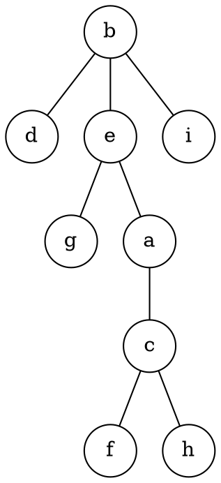
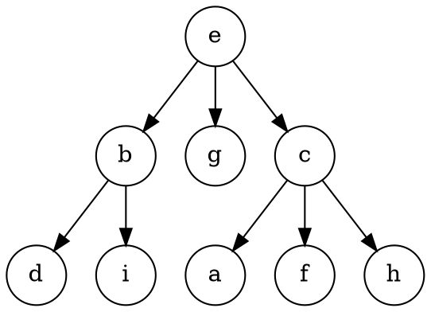
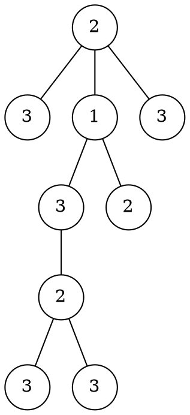
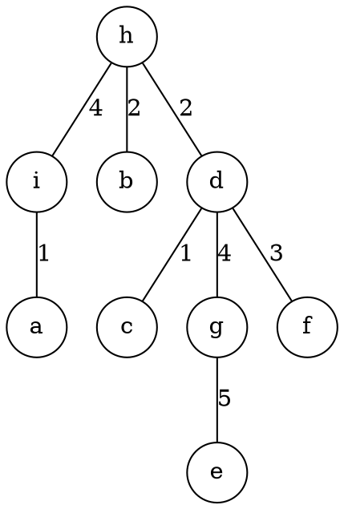
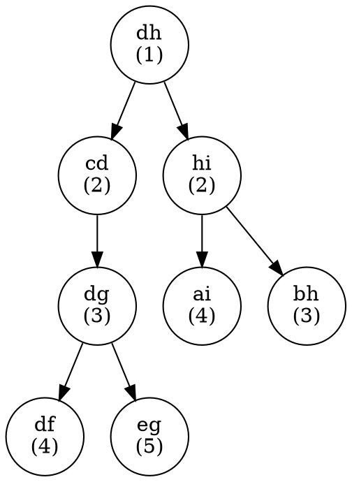

A few days ago, I was thinking about the tree that results from centroid decomposition as well as Cartesian trees, and noticed a surprising similarity. I continued exploring this idea, and (re)discovered a new data structure, that provides surprising insights into graph problems using the max weight edge in a path (widest path problems).

<!--more-->

> In this post, I create a lot of terminology to refer to things that are new. If you find an existing source which described things similar to what I'm describing, please notify me and I'll update this post.
>
> Edit: if you search for "Cartesian tree of edges", you'll find papers describing the stuff I detail here. 

> This post is currently WIP, but the main content is there. I'm posting what I currently have, and I'll complete it when I can. One part of this is turning the DOT code into actual graphs

# Implicit Divide and Conquer Trees

Before we get into the data structure, let's see the similarity between a Cartesian tree and a centroid tree.

A centroid tree is one generated from recursively finding the centroid of a tree (yes, it's a bit circular, but hold on). A centroid is the node which, when removed, divides the tree into a forest, where all trees are no larger than half the original tree. By recursively finding the centroids of the remaining trees, you generate the centroid tree.

This is useful if you want to find a node in the tree, and you can only determine which subtree adjacent to a node the target is (see FARIO 2019 Nav). In a sense, it's like a binary search tree.

*Figure. 1: A random tree*

*Figure 2: The centroid decomposition of said tree*

If we abstract away the centroid calculation into a number assigned to each node, then the centroid tree becomes a sort of "Cartesian tree of a tree", with the root being the largest node in the tree, and the children the centroid trees of the remaining connected components.

*Figure 3: The original tree, with the nodes relabelled with their depth in the centroid tree*

As you can see, the centroid tree can be defined recursively, and so can a Cartesian tree. Similarly, a binary search tree is basically a centroid tree of a linear chain. All these kinda of trees can be broadly described in a way that appears like divide and conquer, leading to their name of "Implicit divide and conquer trees"[^1]. They can roughly be defined in this way -- for some given some structure (state space, graph, etc.):

- The root is an element of this structure, which is subsequently removed.
- The subtrees are implicit D&C trees of the disjoint parts of the remaining structure after the root element is removed.

[^1]: Thanks to Tunan Shi suggesting this name to me.

From here on out, I'll be talking a lot about implicit D&C trees representing trees, so it may be ambiguous, or at least confusing, which tree I'm referring to. To remedy this, I'll be referring to the nodes of the implicit D&C tree as "elements" and their subtrees as "substructures". Note that these names are completely made up.

# Edge Trees (and Edge Heap)

This leads us to my discovery of the edge tree. The somewhat annoying part of implicit D&C trees on the vertices of a tree is that each element can have an unbounded number of substructures. In the fig. 2, the root (node 5) has 3 children. In the worst case of a star network, the centre node has $$V-1$$ children. This can easily be resolved by instead building the tree on the edges. Since each edge only connects two subtrees, the resulting D&C tree is guaranteed to be binary.

One good use case for this are problems which have a weighted tree and use the maximum/minimum along a path (e.g. query-only subtask of APIO 2019 Bridges). Traditionally, this can either be done with a Dijkstra (using min/max instead of plus when adding an edge to a path), or with union find if the problem is offline ("merging" nodes in order of edge weight). However, a "Cartesian" tree on the edge weights is similarly useful, and provides deeper insight.

The way you can make such a tree is by augmenting a Kruskal's MST algorithm to additionally track the roots of the edge trees.

> Note: Edge trees are only really useful when online queries are required. If the problem is offline-only, it's often easier to just do Kruskal's normally. From here on out, I'm assuming the problem is online.

Here we have a random tree with weighted edges to demonstrate what I mean:

*Figure 4: A weighted tree*

*Figure 5: The Cartesian tree on the edges*

Say we want to support the following query:

> Given a edge E and weight limit W, what is the number of nodes reachable from E using only edges with weight ≥ W? You are guaranteed that W is less than E's weight.

By constructing an edge tree, we can see that the structure with E as its root contains all edges accessible using a weight lower than E's weight. Additionally, we can "traverse" up the tree if the parent element's weight is greater than W [^2]. We can keep doing this until we reach an element we can't pass, and the size of the structure is the number of edges reachable. Since the whole thing is a tree, the number of nodes is the number of edges +1.

> **TODO: Examples using the above trees**

[^2]: You may notice that the worst case time complexity is $$O(E)$$ in the case of a linear graph. This can be reduced to $$O(\log E)$$ if we use jump pointers (like the classical LCA algorithm), at the cost of $$O(E \log E)$$ memory. Usually, this is a worthwhile trade.

However, problems are more commonly based on the vertices of a graph. So how can we support this query?

> Given a vertex V and a weight limit W, what is the number of nodes reachable from V using only edges with weight ≥ W?

The only change from the previous one is that we're querying off vertices. One neat trick that we can do is to create self-edges for every node, thus simulating vertices using only edges. This is one benefit of edge-based data structures - you can sometimes trivially support vertices as well by representing them as self-edges.

After this change, the query is basically the same. However, we notice that only these self-edges are ever leaves. Since each substructure is a range accessible by a certain weight, we can actually map these nodes into an array! While not particularly helpful here, it's a potentially useful insight that may help.

---

Here's a related query. While this problem may appear in graph form, it can be reduced down to a tree by taking the MST.

> Given two vertices V and U, what is the minimum weight edge required to form a path between V and U. It is guaranteed U is reachable from V.

One way to do this is to root the tree, then find the LCA of U and V and the corresponding minimum weight on the paths to the LCA. We know normal LCA is reducible to RMQ, but the need to know the minimum weight as well forces us to use the jump pointers approach (which I don't particularly like).

However, with an edge tree, this problem reduces down to just LCA -- to find the min edge which connects the two nodes. This can reduce to RMQ using the Eulerian Tour Technique, but we can slightly improve on this. Since the nodes we're querying from are always the leaves, we can convert the tree to an array by just traversing it in-order.

# Near-far Ordering for O(1) Edge Deletion

> **TODO: Tag child edges w/ path to parent/path away from parent. And demonstration of how this allows for O(1) edge deletion**